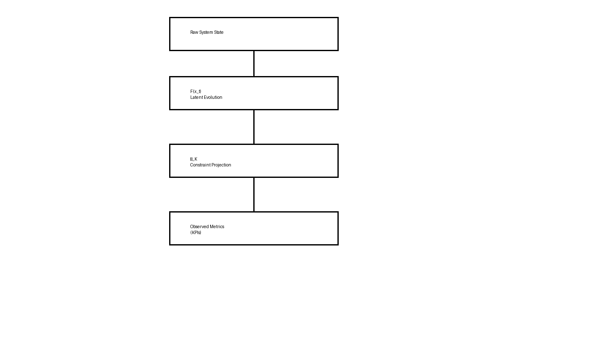
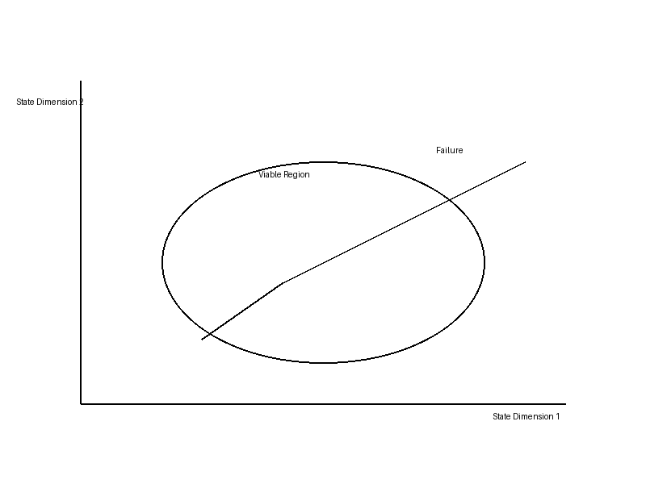
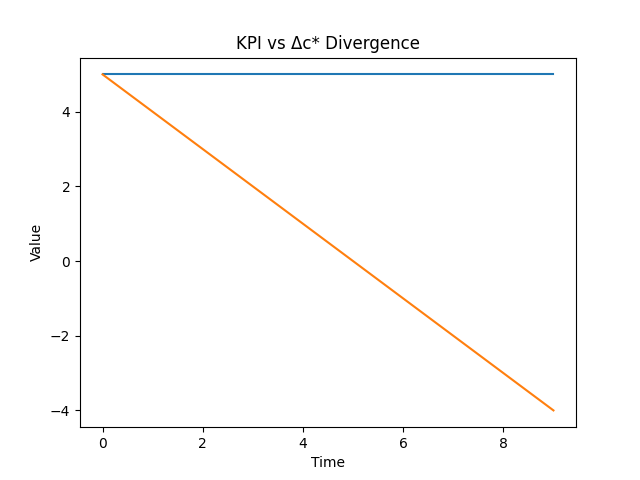

# CANON — Constraint-First Modeling for Systems Under Load


**CANON (Constrained Autonomous Node-state Operational Network)**  
A constraint-first state-evolution framework for understanding how complex systems behave under load.

This repository contains:
- the governing model
- operator system
- observability framework
- and an applied hospital operations example

> The hospital materials (LOS, bed flow) are an **example use case**, not the full scope of the system.

---

## 🔹 What this actually is

CANON is:
- a **state model** (not a metric)
- a **constraint system** (not a predictor)
- a **diagnostic lens** (not a dashboard)

It answers:
> → "Is the system still viable?"

Not:
> → "What are the numbers?"

This reduces misinterpretation immediately.

---

## 🔹 Start here

If you're new, begin with the examples:

- `examples/shift_failure_case.md`  
  → a shift that collapses despite stable KPIs  

- `examples/shift_contrast_case.md`  
  → same visible setup, different outcome  

- `examples/toy_delta_c_comparison.md`  
  → numeric illustration of latent state divergence  

---

## 🔹 How it connects to real systems

- `domain/input_mapping.md`  
  → how real-world signals map to CANON variables  

- `domain/data_schema.md`  
  → minimal dataset structure  

- `domain/retrospective_evaluation.md`  
  → how this can be tested using real data  

---

## 🔹 The formal system

- `theory/CANON_MATH_v1.md`  
- `theory/CANON_OPERATORS.md`  
- `theory/CANON_OBSERVABILITY.md`  
- `theory/CANON_GOVERNING_LAYER.md`  
- `spec/CANON_SYSTEM_v3.9.53.json`  

---

## 🔹 Why this exists

In many systems, things can appear stable:

- metrics are within expected range  
- throughput appears normal  
- nothing is obviously broken  

And yet the system still fails.

This shows up as:

- sudden overload  
- delayed outcomes  
- coordination breakdown  
- "everything was fine until it wasn't"  

Traditional dashboards struggle to explain this.

---

## 🔹 The problem

Most systems compress state into metrics:

- occupancy  
- throughput  
- performance indicators  

These are **projections**, not full system representations.

They do not preserve:

- accumulated load  
- mismatch between demand and configuration  
- loss of structure during observation  

> Two situations with identical metrics can produce different outcomes.

---

## 🔹 Core idea

System behavior depends on **latent state**, not just visible values:

- **H** — accumulated load  
- **L_P** — projection loss  
- **ΩV** — viability margin  
- **Π** — regulatory pressure  

Failure occurs when:

> the system can no longer remain within its viable state space

—not when a metric crosses a threshold.

---

## 🔹 Governing principle

```text
x_{t+1} = Π_K(F(x_t))
```

- **F(x_t)** → latent evolution  
- **Π_K** → constraint projection  

---

## 🔹 System Flow



**How to read this:**
- Left → right = time evolution
- F(xₜ) = latent system dynamics (unobserved)
- Π_K = constraint enforcement (viability boundary)
- Output = projected metrics (what dashboards see)

**Key implication:**  
The system you observe is not the system that exists.

---

## 🔹 Viability Boundary (Conceptual)



**Interpretation:**
- The system evolves inside a constrained state space
- Drift toward boundary = instability
- Crossing boundary = failure

**Key idea:**  
Failure is geometric (leaving the viable region), not numeric (threshold crossing).

---

## 🔹 Latent vs Visible Behavior



**What this shows:**
- KPI → flat (appears stable)
- Δc* → drifting (latent degradation)

**What to notice:**
- divergence begins *before* visible change
- KPI reacts late → reactive system

**Operational implication:**  
Dashboards detect failure *after it is already underway*.

---

## 🔹 From Real Data to CANON State


**Flow:**  
ADT / Orders / Staffing → Proxy Mapping → Latent State → Δc* → Diagnostic Output

**Key point:**  
CANON does not replace data — it restructures it into state.

---

## 🔹 Example Output (Trace)


**Shows:**
- Δc* trajectory
- stability vs degradation phase
- failure onset

**Purpose:**  
Demonstrates what a real diagnostic run would produce.

---

## 🔹 What CANON models

- State evolution over time  
- Constraint boundaries  
- Latent load accumulation  
- Loss of observability  
- Structural failure trajectories  

---

## 🔹 What this explains

Patterns traditional metrics miss:

- identical metrics → different outcomes  
- stable dashboards → failing systems  
- sudden collapse → slow latent degradation  
- no individual failure → systemic breakdown  

---

## 🔹 Numeric illustration

See:

`examples/toy_delta_c_comparison.md`

This shows:

- same visible conditions  
- different latent variables  
- different Δc* trajectories  

> The model is illustrative, not calibrated.

---

## 🔹 Repository structure

```text
/theory
/spec
/domain
/examples
/atlas
/implementation
```

---

## 🔹 Reading path

**Recommended:**
1. examples/shift_failure_case.md  
2. examples/shift_contrast_case.md  
3. examples/toy_delta_c_comparison.md  
4. domain/input_mapping.md  
5. domain/retrospective_evaluation.md  

---

## 🔹 Scope

This repository is:

- a system model  
- an observability framework  
- a diagnostic structure  

This repository is not:

- a production system  
- a predictive tool  
- a clinical deployment  

---

## 🔹 Limitations

- not empirically validated  
- not calibrated to real datasets  
- proxy-based mapping  

Future work:

- real dataset evaluation  
- calibration of variables  
- measurement of lead time vs KPIs  

CANON can be evaluated using shift-level data:

- `domain/input_mapping.md`  
- `domain/data_schema.md`  
- `domain/retrospective_evaluation.md`  

---

## 🔹 Positioning

CANON is not:

- a dashboard  
- a single metric  
- a forecasting tool  

It is:

> a framework for understanding system viability under constraint

---

## 🔹 Summary

Traditional systems ask:

> "What are the numbers?"

CANON asks:

> **"Is the system still viable?"**

