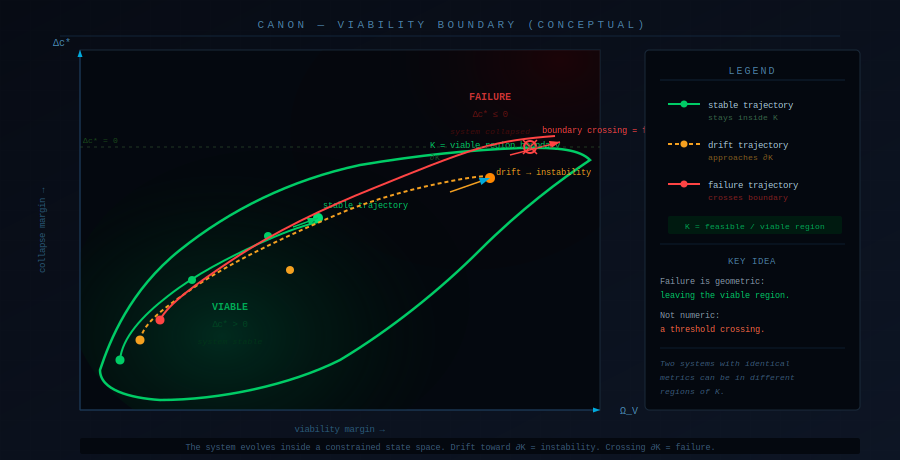

# CANON — Constraint-First Modeling for Systems Under Load


**CANON (Constrained Autonomous Node-state Operational Network)**  
A constraint-first state-evolution framework for understanding how complex systems behave under load.

This repository contains:
- the governing model
- operator system
- observability framework
- and an applied hospital operations example

> The hospital materials (LOS, bed flow) are an **example use case**, not the full scope of the system.

---

## 🔹 What this actually is

CANON is:
- a **state model** (not a metric)
- a **constraint system** (not a predictor)
- a **diagnostic lens** (not a dashboard)
- a **structure-mapping system** (not domain-specific)

It answers:

> → "Is the system still viable?"

Not:

> → "What are the numbers?"

This reduces misinterpretation immediately.

---

## 🔹 Start here

If you're new, begin with the examples:

- `examples/shift_failure_case.md`  
  → a shift that collapses despite stable KPIs  

- `examples/shift_contrast_case.md`  
  → same visible setup, different outcome  

- `examples/toy_delta_c_comparison.md`  
  → numeric illustration of latent state divergence  

---

## 🔹 How it connects to real systems

- `domain/input_mapping.md`  
  → how real-world signals map to CANON variables  

- `domain/data_schema.md`  
  → minimal dataset structure  

- `domain/retrospective_evaluation.md`  
  → how this can be tested using real data  

---

## 🔹 The formal system

- `theory/CANON_MATH_v1.md`  
- `theory/CANON_OPERATORS.md`  
- `theory/CANON_OBSERVABILITY.md`  
- `theory/CANON_GOVERNING_LAYER.md`  
- `spec/CANON_SYSTEM_v3.9.53.json`  

---

## 🔹 Why this exists

In many systems, things can appear stable:

- metrics are within expected range  
- throughput appears normal  
- nothing is obviously broken  

And yet the system still fails.

This shows up as:

- sudden overload  
- delayed outcomes  
- coordination breakdown  
- "everything was fine until it wasn't"  

Traditional dashboards struggle to explain this.

These failures are not domain-specific — they reflect shared structural constraints across systems.

---

## 🔹 The problem

Most systems compress state into metrics:

- occupancy  
- throughput  
- performance indicators  

These are **projections**, not full system representations.

They do not preserve:

- accumulated load  
- mismatch between demand and configuration  
- loss of structure during observation  

> Two situations with identical metrics can produce different outcomes.

---

## 🔹 Core idea

System behavior depends on **latent state**, not just visible values:

- **H** — accumulated load  
- **L_P** — projection loss  
- **ΩV** — viability margin  
- **Π** — regulatory pressure  

Failure occurs when:

> the system can no longer remain within its viable state space

—not when a metric crosses a threshold.

---

## 🔹 Orthogonal application (why this scales)

CANON is not limited to a single domain.

It models systems at the level of:
- constraint  
- load  
- state evolution  
- viability boundaries  

Because of this, structures observed in one system can be applied to another.

This enables **orthogonal transfer**:

> A solution that stabilizes one system may apply to another system with similar constraint geometry—even if the domains are unrelated.

Examples:

- A coordination pattern in hospital flow may map to distributed computing  
- A regulatory structure in biology may inform organizational design  
- A tension-resolution pattern in one domain may reflect the same constraint dynamics in another  

The domains differ.  
The underlying structure does not.

CANON provides a way to identify those shared structures.

---

## 🔹 Governing principle

```text
x_{t+1} = Π_K(F(x_t))
```

- **F(x_t)** → latent evolution  
- **Π_K** → constraint projection  

---

## 🔹 System Flow


**How to read this:**

- Top layer = latent domain: x_t evolves through F(x_t), unobserved  
- Π_K = viability boundary — a spatial constraint, not a process step  
- Funnel = projection loss: 6 latent channels compress to 2 observable outputs  
- Bottom layer = observed domain: what dashboards see (H, L_P, A_s absent)  

**Key implication:**  
The system you observe is a compressed projection. The variables that drive failure are not visible in it.

---

## 🔹 Viability Boundary (Conceptual)



**How to read this:**

- The bounded region is K — the set of states the system can occupy while remaining viable  
- Three trajectory types: stable (within K), drift (approaching ∂K), failure (crossing ∂K)  
- Trajectories are curved — constrained evolution is not linear  

**Key idea:**  
Failure is geometric: the system leaves the viable region.

---

## 🔹 Latent vs Visible Behavior


**How to read this:**

- Purple line = KPI — near-flat across all phases  
- Colored line = Δc* — drifting from the start  
- Shaded region = hidden instability phase  
- Red zone = latent failure  

**Operational implication:**  
Dashboards detect failure after it is already underway. Δc* leads by design.

---

## 🔹 From Real Data to CANON State


**How to read this:**

- Raw data → proxy mapping → latent state → Δc* output  

**Key point:**  
CANON restructures data into state. Output is diagnostic, not predictive.

---

## 🔹 What CANON models

- state evolution  
- constraint boundaries  
- latent load  
- observability loss  
- failure trajectories  

---

## 🔹 What this explains

- identical metrics → different outcomes  
- stable dashboards → failing systems  
- sudden collapse → slow degradation  
- systemic failure without individual failure  

---

## 🔹 Numeric illustration

See:

`examples/toy_delta_c_comparison.md`

---

## 🔹 Repository structure

```
/theory
/spec
/domain
/examples
/atlas
/implementation
```

---

## 🔹 Reading path

1. examples/shift_failure_case.md  
2. examples/shift_contrast_case.md  
3. examples/toy_delta_c_comparison.md  
4. domain/input_mapping.md  
5. domain/retrospective_evaluation.md  

---

## 🔹 Scope

This repository is:
- a system model  
- an observability framework  
- a diagnostic structure  

Not:
- production system  
- predictive tool  
- clinical deployment  

---

## 🔹 Limitations

- not empirically validated  
- proxy-based mapping  

Future work:
- real dataset evaluation  
- calibration  
- lead-time measurement  

---

## 🔹 Positioning

CANON is not:
- a dashboard  
- a metric  
- a forecast  

It is:

> a framework for understanding system viability under constraint

---

## 🔹 Summary

Traditional systems ask:

> "What are the numbers?"

CANON asks:

> **"Is the system still viable?"**

And more importantly:

> **"What other systems have already solved this constraint?"**

