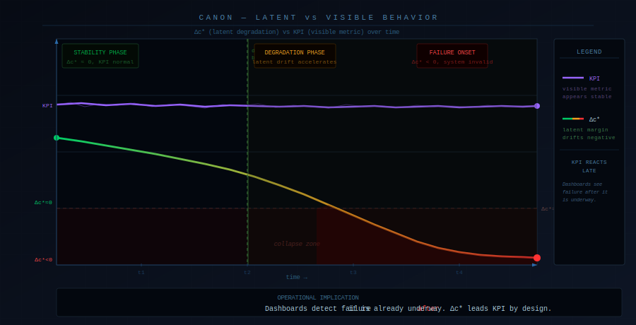
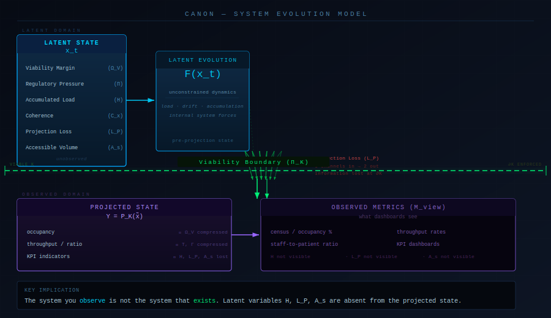
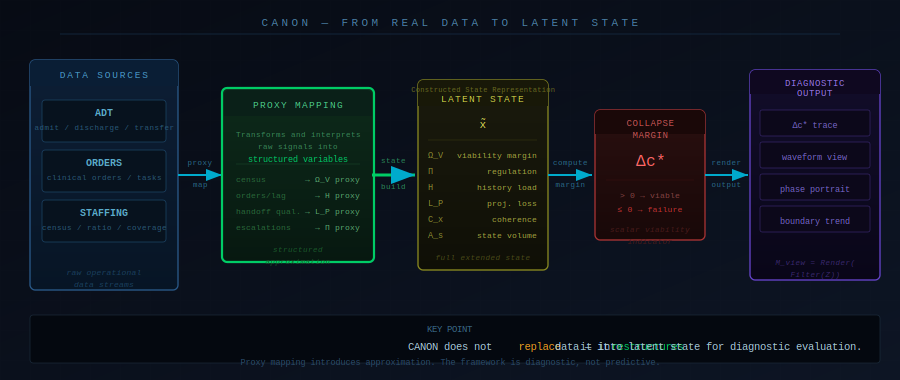

# CANON — Constraint-First Modeling for Systems Under Load


---

## 🔹 What this is (in 30 seconds)

Most systems fail in a way that looks like this:

Metrics are stable. Nothing appears broken. Then the system collapses.

This happens because the system's *state* is not the same as what its metrics show. Dashboards compress reality into projections. The projections look fine. The underlying state is already failing.

**CANON models the underlying state.**

If you've ever seen "everything was fine until it wasn't" — this framework explains why.

---

## 🔹 The core insight

Two systems can show identical metrics and be in completely different states.

One is stable. One is already failing. No dashboard can distinguish them.



**How to read this:**
- The flat line is your KPI — no early signal
- The descending line is Δc\* — drifting toward collapse from the first observation
- The shaded region is hidden instability, invisible to dashboards
- Δc\* crosses zero *before* visible failure — by design

This is not a visualization of a hypothesis. It is a structural consequence of how dashboards work: they observe projections, not state.

---

## 🔹 What that looks like in numbers

Two shifts. Same census. Same staffing. Same dashboard.

| Setup   | ΩV   | H    | L_P  | Δc\*   |
|---------|------|------|------|--------|
| Stable  | 0.52 | 0.12 | 0.10 | +0.06  |
| Failing | 0.42 | 0.45 | 0.35 | −0.11  |

Both look equivalent at the KPI layer. The latent state is not equivalent. One is within the viable region. One has already left it.

This is the threshold between a purely verbal model and a state-based diagnostic framework.

---

## 🔹 What CANON actually is

CANON (Constrained Autonomous Node-state Operational Network) is:

- a **state model** — not a metric
- a **constraint system** — not a predictor
- a **diagnostic lens** — not a dashboard
- a **structure-mapping framework** — not domain-specific

It answers:

> **"Is the system still viable?"**

Not:

> "What are the numbers?"

---

## 🔹 The governing principle

```
x_{t+1} = Π_K(F(x_t))
```

The system evolves through its internal dynamics (`F`), then is projected back into what it can actually sustain (`Π_K`). The gap between those two — between what the system *tries* to do and what it is *constrained* to do — is where failure begins.

Most observability frameworks track `F`. CANON tracks `Π_K`.

---

## 🔹 Core variables

- **ΩV** — viability margin (remaining operational headroom)
- **Π** — regulatory pressure (effort to stay feasible)
- **H** — accumulated load (path-dependent history, invisible to dashboards)
- **L_P** — projection loss (structural information destroyed by observation)

Failure occurs when the system leaves its viable state space — not when a single metric crosses a threshold.

---

## 🔹 The system flow



**How to read this:**
- Top layer: latent domain — x_t evolves through F(x_t), unobserved
- Π_K: viability boundary — a spatial constraint, not a process step
- Funnel: projection loss — latent channels compress into observable outputs
- Bottom layer: observed domain — what dashboards see (H, L_P absent)

The system you observe is always a compressed projection of a fuller state. CANON tracks the fuller state.

---

## 🔹 Demonstration domain: hospital operations

CANON is applied to hospital shift operations not because that is the limit of the framework, but because it is where the failure mode is most legible:

- metrics are standardized (census, LOS, throughput)
- failure modes are well-documented
- the gap between observable KPIs and latent system state is large and consequential

Hospital systems are the demonstration domain. The math does not change when the domain does.

See `examples/shift_failure_case.md` for a grounded walkthrough — evidence-anchored in JAMA (2024), MedPAC (2024), CMS CoP guidance, and Joint Commission patient flow standards.

For the full integrated reference view of the hospital domain application:

- [`atlas/canon_los_atlas.html`](atlas/canon_los_atlas.html) — CANON × Hospital Operations integrated reference atlas (v3.9.53): variables, constraints, failure channels, and domain mapping in a single navigable artifact

---

## 🔹 Orthogonal application

CANON operates at the level of:

- constraint
- load accumulation
- state evolution
- viability boundaries

Because of this, structures transfer across domains without reformulation:

- hospital flow ↔ distributed systems
- biology ↔ organizational design
- coordination patterns ↔ information systems

The domains differ. The structure does not.

---

## 🔹 Start here

If you're new, begin with the examples — this takes ~5 minutes and builds full intuition:

1. `examples/shift_failure_case.md` — a shift that collapses despite stable KPIs
2. `examples/shift_contrast_case.md` — same visible setup, different latent state, different outcome
3. `examples/toy_delta_c_comparison.md` — numeric illustration of latent state divergence

Then:

4. `domain/input_mapping.md` — how real-world signals map to CANON variables
5. `domain/retrospective_evaluation.md` — how this can be tested against real data

---

## 🔹 How real data connects to CANON state



**How to read this:**
- Left: raw operational data sources (ADT, Orders, Staffing)
- Proxy Mapping: signals are interpreted into CANON variables — not relabeled, restructured
- Center: constructed latent state x̃, with adjunct variables populated
- Right: Δc\* computed from latent state, rendered as diagnostic output

CANON does not replace data. It restructures data into state. The output is diagnostic, not predictive.

---

## 🔹 What this explains

Patterns that traditional metrics structurally cannot detect:

- identical metrics → different outcomes
- stable dashboards → failing systems
- sudden collapse → slow latent degradation
- no individual failure → systemic breakdown

---

## 🔹 Repository structure

```
/theory          — governing equations, operators, observability framework
/spec            — machine-readable execution specification (v3.9.53)
/domain          — input mapping, data schema, retrospective evaluation
/examples        — grounded case studies and numeric comparisons
/atlas           — system diagrams and reference visualizations
/implementation  — prototype interpreter (Python)
```

---

## 🔹 Formal system references

- `theory/CANON_MATH_v1.md`
- `theory/CANON_OPERATORS.md`
- `theory/CANON_OBSERVABILITY.md`
- `theory/CANON_GOVERNING_LAYER.md`
- `spec/CANON_SYSTEM_v3.9.53.json`

---

## 🔹 Interactive atlas

Two navigable HTML reference artifacts are included for deeper orientation:

- [`atlas/canon_influence_architecture.html`](atlas/canon_influence_architecture.html) — the full influence architecture of the CANON system: how variables relate, propagate, and interact across the constraint boundary
- [`atlas/canon_los_atlas.html`](atlas/canon_los_atlas.html) — the hospital operations domain instantiation: variables mapped to real operational signals, constraints defined, failure channels identified

These are standalone reference artifacts — no server required, open directly in a browser.

---

## 🔹 Scope

This repository is:

- a system model
- an observability framework
- a diagnostic structure

This repository is not:

- a production system
- a predictive tool
- a clinical deployment

---

## 🔹 Limitations

- not empirically validated against real datasets
- proxy-based variable mapping (approximation, not measurement)
- interpreter is prototype-grade, non-calibrated

Future work:

- real dataset evaluation against shift-level KPI baselines
- calibration of proxy estimation functions
- measurement of detection lead time vs. standard metrics

The domain files support this directly:
- `domain/input_mapping.md`
- `domain/data_schema.md`
- `domain/retrospective_evaluation.md`

---

## 🔹 Summary

Traditional systems ask:

> "What are the numbers?"

CANON asks:

> **"Is the system still viable?"**

And when the answer is no — it asks it *before the dashboard does*.

