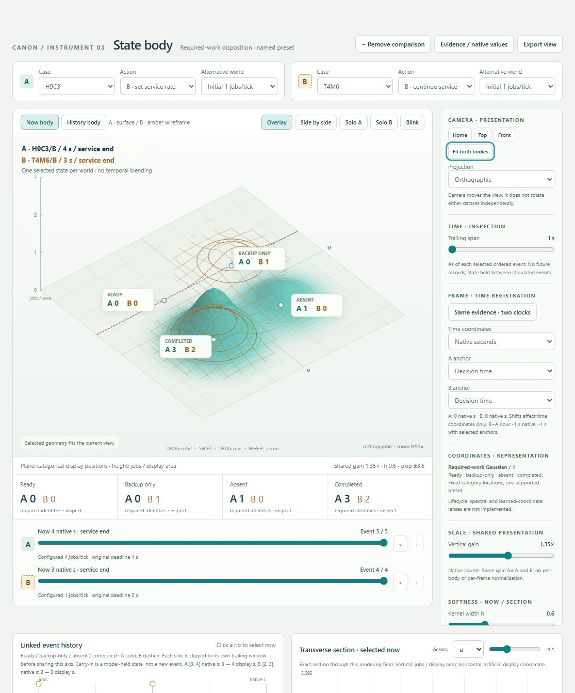
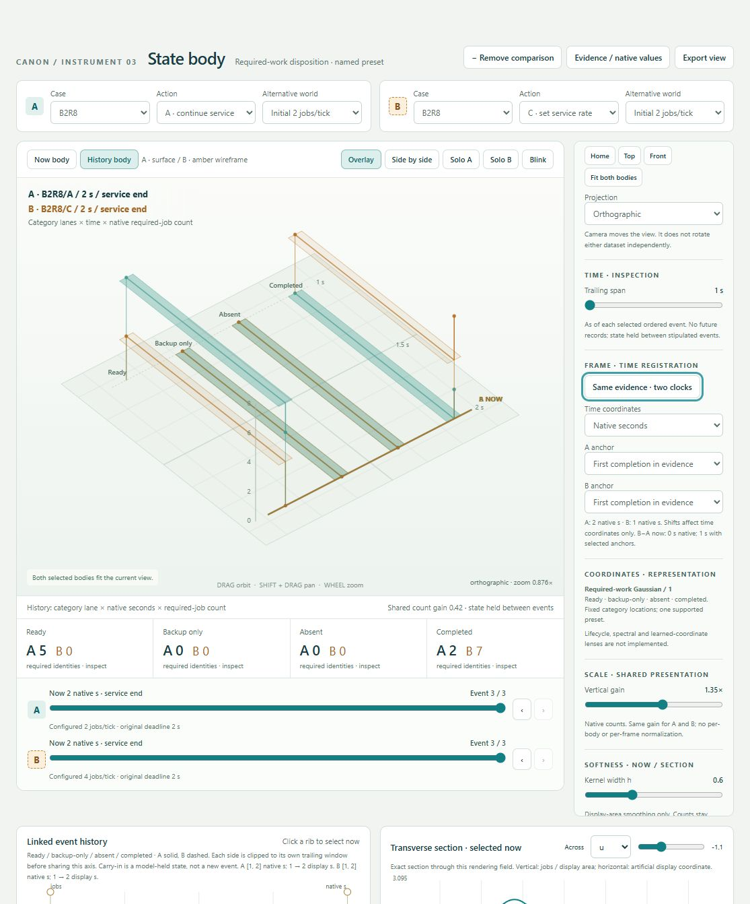
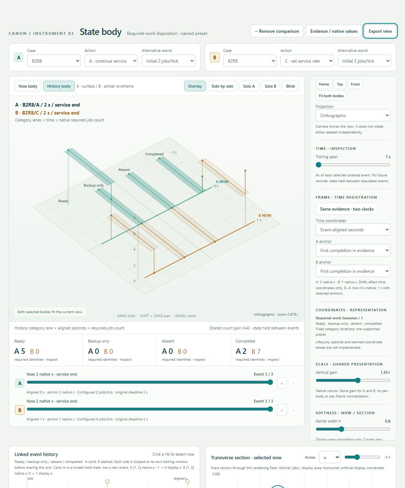
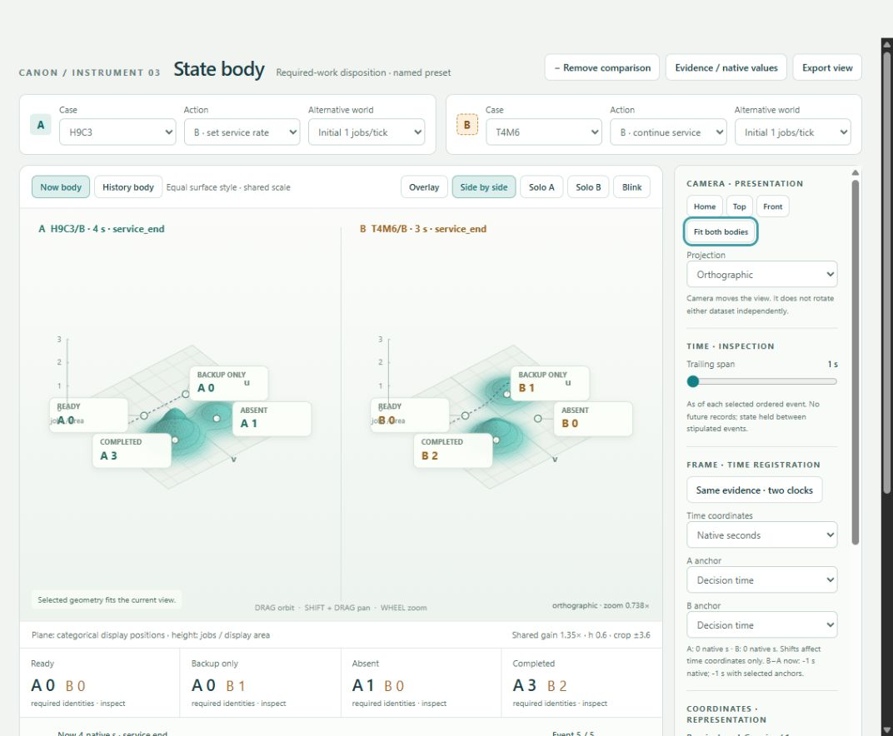
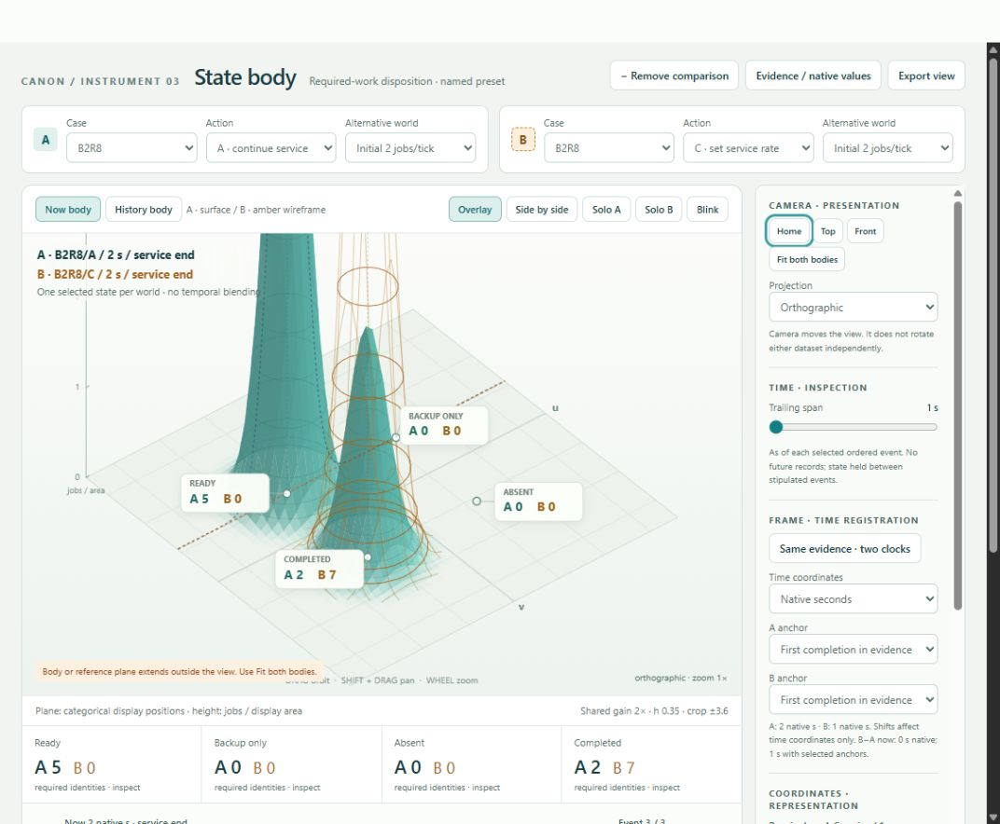
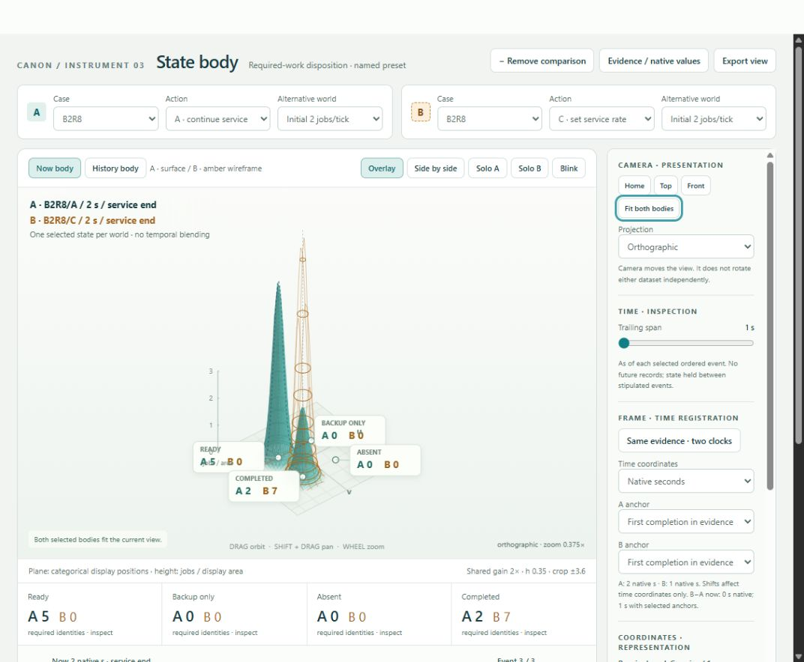
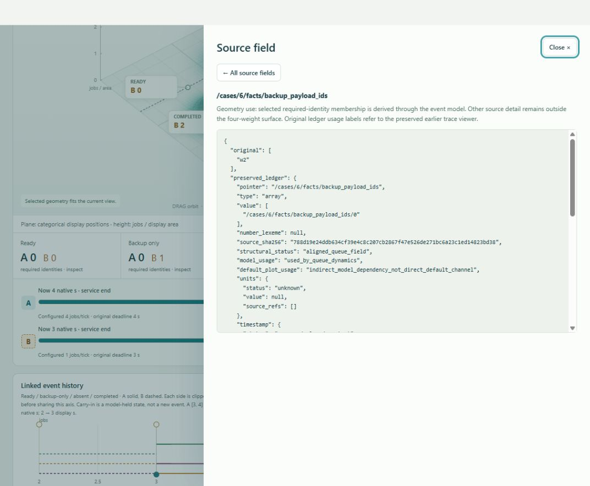

# Browser evidence

Actual Codex in-app browser interactions against `http://127.0.0.1:8769/index.html` on 2026-10-02. The initial visible viewer was left available when its selections changed independently; further verification used a separate background tab. No external browser automation, mock screenshot, or synthetic browser-success claim is used here. Module checks remain separate.

The first initial capture showed a blank canvas. A Fit action produced the body; a subsequent clean reload of the completed build rendered the body without an interaction. The final body and comparisons below are actual captures. This does not establish a universal browser first-paint guarantee.

| Action | Browser result |
|---|---|
| Open/reload the completed viewer | Default T4M6/A pre-action body: ready 2, backup-only 1. |
| Native/event-relative frame exercise | Same source hashes, record IDs and partitions. Both native windows `[1,2]`; aligned A `[-1,0]`, B `[0,1]`; common extent `[-1,1]`. |
| Move A before its first completion | Current A ready count updates to 7. Unavailable anchor is explicit, aligned history withheld. This caught and corrected a renderer integration error that had left stale UI values. |
| Unequal selected times, span 1 | H9C3/B at 4s uses `[3,4]`; T4M6/B at 3s uses `[2,3]`; common axis `[2,4]`. Renderer record contains only each side's two in-window events. |
| Narrow kernel 0.35, gain 2, Home camera | Visible out-of-frame notice. |
| Fit both after clipping | Clipped true → false. Exact selected evidence and encoding/calibration remained equal. Shared zoom 1 → 0.37484430556951914, panY 0 → 116.62773864045283 at this viewport. |
| Equal-style side-by-side and Solo B | Both panels use the same filled material; Solo B is selectable. Identity labels remain explicit. |
| Category/source drill-down | Backup-only B count 1 resolves to `w2`, original source array and retained typed ledger. Searching `preserved_unaligned` returns unused source content. |
| Restore unsupported kernel | Visible useful error; current view retained. |
| Restore missing source revision | Visible missing-source error; no substitute revision loaded. |
| Restore valid saved checkpoint, export again | Same requested state/camera, selected records/partitions, and comparison/windows. |
| Final console inspection | No warnings or errors captured in the isolated verification tab. |

## Captures

Current body comparison:

The same source records in native seconds:

The same source records in event-relative seconds:

Equal-style inspection:

Shared camera fit before and after (native counts and calibration unchanged):

Source resolution:

## Limits

Human perceptual acceptance remains the user's decision. Side-by-side labels can be crowded at narrow panel widths; shared fit establishes in-frame geometry, not guaranteed text separation. Mobile layouts, cross-browser replay, pixel identity, direct file chooser restore and download completion were not verified in this pass. Visible JSON export and paste restore were verified. Shift/right-drag pan was retained but not newly exercised. No comparative effectiveness, physical interpretation, lifecycle inference or frequency analysis is claimed.

## Linked instruments browser acceptance — 2026-10-02

Chrome, real local offline bundle through a loopback server. The following were exercised through UI controls:

- Verified case descriptions and ordinary action/world labels. Stable T4M6/A remains in Technical details.
- Relationship at T4M6/A event 4 renders the retained five-state replay path, with separate pre/post action points at native zero; Over time can remain as a linked companion.
- Clicking Relationship event 1 updates the cursor readout and evidence panel to post-action at 0 s: three ready and three unfinished. Evidence resolves the same exact ordered record and source pointers.
- A/B comparison at the original deadline reads replay (0 ready, 0 unfinished), continuing (0 ready, 1 unfinished). Worlds remain separate.
- Native/aligned clocks and independent anchors preserve values. With a -0.5 s pan, displayed A native window [-1.5,2.5] matches the exported shared observation-frame window; the selected event remains at 3 s and is identified as outside the panned interval.
- Transform prefix mode permits samples 0–512 only. Inspecting sample 500 reports support through 512, right zero padding, and the edge flag. Raw trace ends at 4 s. It is explicitly a synthetic calibration signal, separate from the selected queue.
- Exported a prefix transform, changed the signal, then restored it. Chirp/prefix/endpoint512/row24/sample500 and coefficient magnitude returned exactly. `example-timescale-prefix.json` is that UI export.
- An unsupported transform version was rejected with a visible error, keeping the current view. `example-multiview.json` is an actual UI export of aligned A/B direct views and pan.
- Final screenshots document the installed direct view and calibration map. Browser checks establish controls, text, linking, and observed layout; mathematical accuracy comes from the separate numeric tests, not screenshots.

No data generator, benchmark, acquisition workflow, or general architecture audit was run.

## Current multiview extension — 2026-10-02

Executable SHA-256: `cdc5257e5e2e8a01c81a6ab8a68cfc72e041d5be2b9753d4cea4be511a5117b0`. Checked the running 8769 viewer with actual browser interaction. Existing earlier sections/screenshots are historical evidence for their original passes.

- Direct clicks in both Timescale views select the same original coefficient. Final illustrated selection: sample 473, row 28, 3.6953125 s, 13.806101038684778 Hz, magnitude 1.2977801994164806. Color and height share [0, 2.1277996444000857]. Orbit changed yaw while the coefficient readout stayed identical.
- Prefix endpoint 512 with center 512 and row 28 reads samples 438–512 and has 74 right padding samples. Kernel offset +74 resolves to padding at requested index 586, with **no observed source value**; both complex contributions are zero. The displayed tiny kernel value preserves `e-20`. Exact kernel sums match the stored coefficient.
- System map identity **w2** opens the same native event and source pointers. At event 0 it is backup-only. Event 1 is also native time zero: w2 is ready at FIFO rank 3 and retains a listed backup copy. `/cases/6/facts/backup_payload_ids` drills down to retained `["w2"]` and its ledger entry.
- Selecting event 0 in the Over time companion updates the System map and evidence cursor to that exact pre-action record.
- Explicit layout controls changed both panel heights and width share. Restoring a saved System/Over time workspace recovered 650/550 px, 55% share, event 1 and w2. Native corner drag then changed the companion from 550 to610 px without changing the event. The supplied final workspace example uses a wider 65% primary share for the graph.
- Queue lineage exposes source, producer, record, native feature, frame, separate required-work encoding and renderer. Calibration lineage exposes the selected prefix/kernel/coefficient and a validated camera/mesh record.
- Restore recovered the selected kernel offset after changing it. A tampered rendering-bound record was rejected visibly, preserving the current view. No errors or warnings were recorded in the fresh isolated QA tab.

Screenshots: `browser-extension-timescale.png`, `browser-extension-identity.png`, `browser-extension-workspace.png`, `browser-extension-kernel.png`, `browser-extension-lineage.png`, `browser-extension-queue-lineage.png`. Machine-readable observations: `browser_extension_checks.json`.

Runnable saved examples: `example-timescale-landscape.json`, `example-system-workspace.json`, `example-kernel-inspection.json`. Use Restore view and choose/paste an example. Pixel identity across viewport sizes is not claimed. Narrow System/Lineage panels deliberately provide horizontal scrolling; panel width can be increased. Browser verification does not substitute for the user's perceptual judgment.

## Contained completion pass — 2026-10-02

Current executable SHA-256: `0abf4f3393e5cce1b44477ce6f5496d866925c346dfaede3872710c197508316`.
Actual browser checks were performed in a separate local viewer tab. `browser_completion_checks.json` retains the measurements. Earlier sections/screenshots describe earlier milestones.

- All four modified body receipts (formula, mesh resolution, coordinate units, actual native history timestamp) were rejected by the Restore UI. The valid save restored. New exports separate `rendering_capture`, labeled `unvalidated_historical_capture`, from the replay-validated body receipt. See `browser-completion-receipt-rejection.png`.
- With a narrow side-by-side workspace, panel heights 650→900 px added exactly 250 px to both numeric plot regions. Labels stayed 12 CSS px. Exact point titles, identities and calibration stayed equal. Compact X–Y event labels no longer overlap; native time/dwell remain in point tooltips. See `browser-completion-numeric.png` and `example-completion-workspace.json`.
- A/B point sets remained separate under their common count range. Selecting A event 1 in the companion selected the same post-action record in the evidence readout. System identity `w2` still opened `T4M6/A/world0/e1`, ready at FIFO rank 3 with a retained backup copy.
- The configured-rate lane was checked visibly after fixing its SVG hidden-attribute handling. An internally scrolled panel (301 px) was resized; layout used content-relative offsets rather than treating scroll displacement as extra plot space.
- Timescale panel height 900→1200 px grew both maps 378→504, raw/time/frequency sections 198→264, and kernel 225→300. The coefficient, computational support and shared magnitude bounds stayed fixed. Subsequent selection linked sample 513 / row 24 between 2D and 3D; the Timescale save restored the view and layout. See `browser-completion-timescale.png` and `example-completion-timescale.json`.
- Body-linked transverse-section corner resizing increased its actual SVG height 180→230 px; labels stayed 12 px. See `browser-completion-linked-sections.png`. These existing lower-panel sizes are local presentation adjustments; saved workspace layout covers the primary and companion panels.
- No browser console errors or warnings were observed in the final tab.

Contract evidence is separate: all 13 Node suites, the independent NumPy coefficient reference, protected-source verification and exact assembly check passed (16 commands). All ten prior saves plus two new examples replay. All 152 protected originals and six copied evidence files remain unchanged. Build checks exercise LF, CRLF and CR code/template inputs and verify byte-identical LF-only UTF-8 HTML, while preserving raw evidence revisions and native JSON values.

Limits: these browser observations do not establish universal perceptual usability. Very small panels scroll to preserve minimum readable geometry. The 3D landscape keeps its aspect-preserving projection and shared camera, so its geometry can remain width-limited in a tall narrow panel. No spectrum, spectrogram, synchronized-signal phase, arbitrary data ingestion or CANON-effectiveness claim is added.
